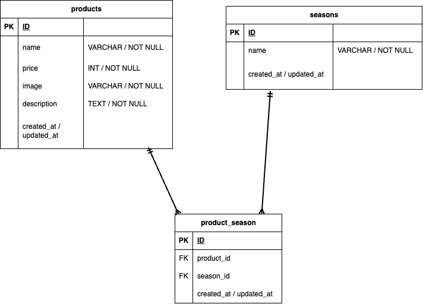

# 商品管理システム（もぎたて）
商品の一覧表示、詳細確認、新規登録、および検索・並び替えを行うアプリケーションです。

## プロジェクト概要
本プロジェクトは、以下のテンプレートリポジトリをベースに開発されています。
- **ベースリポジトリ**: `git@github.com:Estra-Coachtech/laravel-docker-template.git`

## 環境構築
Dockerを使用して環境を構築します。以下の手順に従ってください。

### 1. Dockerビルド
ターミナルでプロジェクトのルートディレクトリに移動し、以下のコマンドを実行します。
```bash
docker-compose up -d --build

docker-compose exec php bash

# パッケージインストール
composer install

# 環境設定ファイルの作成
cp .env.example .env

# アプリケーションキーの生成
php artisan key:generate

# データベースのマイグレーションとシーディング
php artisan migrate --seed

# ストレージのリンク作成（画像表示のために必須）
php artisan storage:link

開発環境（URL）
商品一覧（検索・並び替え）: http://localhost/products/search

商品登録: http://localhost/products/register

商品詳細: http://localhost/products/detail/{productId}

使用技術（実行環境）
PHP: 8.1.34

Laravel: 8.83.8

MySQL: 8.0.26

Nginx: 1.21.1

Docker / Docker Compose

ER図


補足事項
画像アップロード: 商品画像は storage/app/public/products に保存されます。

シンボリックリンク: php artisan storage:link を実行することで、public/storage を経由してブラウザから画像が表示されるようになります。